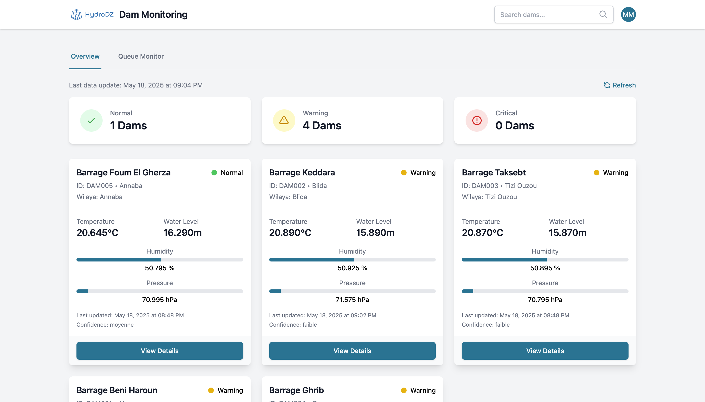

# HydroDz - Water Management System

HydroDz is a comprehensive water management system designed to monitor and manage water resources, particularly focusing on dam monitoring and water quality analysis. The system provides real-time monitoring, data visualization, and analysis tools for water management professionals.

## Pictures




## Features

- **Real-time Dam Monitoring**
  - Water level tracking
  - Flow rate monitoring
  - Reservoir capacity visualization
  - Historical data analysis

- **Water Quality Analysis**
  - pH level monitoring
  - Turbidity tracking
  - Temperature monitoring
  - Chemical composition analysis

- **Queue Management System**
  - Real-time queue status monitoring
  - Queue length tracking
  - Processing time analysis
  - System performance metrics

## Project Structure

```
HydroDz/
├── FrontEnd/
│   ├── src/
│   │   ├── assets/
│   │   ├── components/
│   │   ├── pages/
│   │   ├── routes/
│   │   ├── utils/
│   │   ├── App.jsx
│   │   └── main.jsx
│   ├── public/
│   └── package.json
├── api/
├── consumer/
├── filtrage/
├── Security/
├── simulateur/
└── docker-compose.yml
```

## Prerequisites

- Node.js (v14 or higher)
- npm or yarn
- Docker (for running services)

## Installation

1. Clone the repository:
```bash
git clone https://github.com/yourusername/HydroDz.git
cd HydroDz
```

2. Install Frontend dependencies:
```bash
cd FrontEnd
npm install
```

3. Set up environment variables:
Create a `.env` file in the FrontEnd directory with the necessary environment variables.

## Running the Application

1. Start the services using Docker Compose:
```bash
docker-compose up -d
```

2. Start the Frontend development server:
```bash
cd FrontEnd
npm run dev
```

The application will be available at `http://localhost:5173`

## Project Components

- **FrontEnd**: React-based web application for user interface
- **api**: Backend API services
- **consumer**: Message queue consumer service
- **filtrage**: Data filtering and processing service
- **Security**: Security-related components
- **simulateur**: Simulation service for testing

## Contributing

1. Fork the repository
2. Create your feature branch (`git checkout -b feature/AmazingFeature`)
3. Commit your changes (`git commit -m 'Add some AmazingFeature'`)
4. Push to the branch (`git push origin feature/AmazingFeature`)
5. Open a Pull Request

## License

This project is licensed under the MIT License - see the LICENSE file for details.

Project Link: https://github.com/yourusername/HydroDz 
